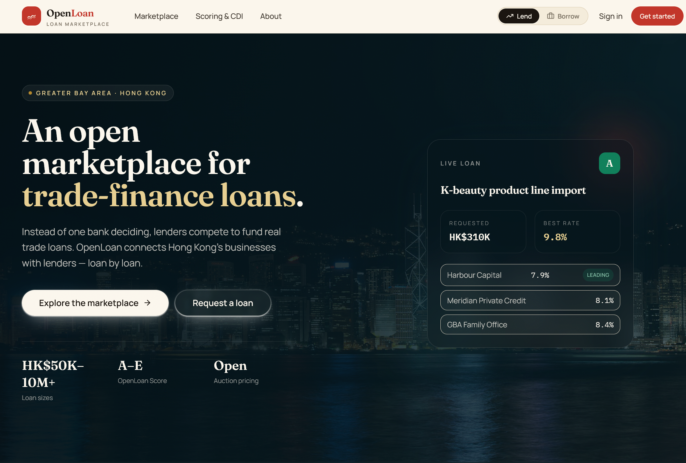
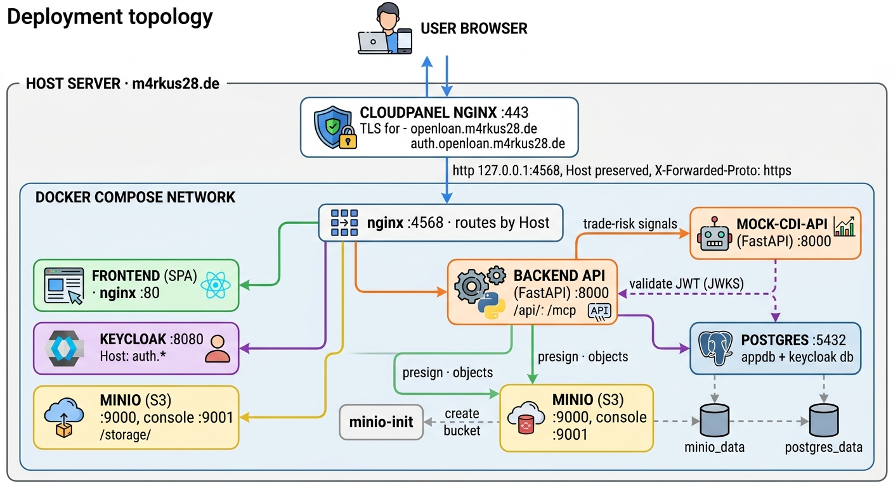

# OpenLoan

**An open marketplace for trade finance** — built for the Hong Kong FinTech Hackathon.

OpenLoan lets small and medium trading businesses raise capital for individual trade
deals, while capital providers (banks, private credit funds, family offices, qualified
investors) compete in an open auction to fund them. Instead of one bank deciding, the
market discovers the rate — deal by deal. The first focus market is Hong Kong and the
Greater Bay Area.

🔗 **Live demo:** [openloan.m4rkus28.de](https://openloan.m4rkus28.de)



> **Demo disclaimer.** This is a hackathon MVP that demonstrates the marketplace flow.
> It is **not** a regulated financial product and figures are illustrative. The
> OpenLoan Score is a *real, rules-based engine* that runs on every deal, but it scores
> against a **mock CDI service** (`mock-cdi-api`) standing in for the HKMA Commercial
> Data Interchange, plus seeded borrower history. See [HONESTY.md](HONESTY.md) for the
> full, line-by-line breakdown of what is real versus mocked.

---

## What it does

- **Public marketplace** — browse current and past deals with search and filters
  (status, industry, trade type, risk grade, sort). Viewable signed-out.
- **Deal detail** — full trade description, company profile, OpenLoan Score breakdown
  (borrower + transaction components, A–E grade, showstopper flags), live bids,
  attached documents, dates.
- **Post a deal** (business) — requested amount, goods, term, route, supplier,
  collateral and file uploads. The backend scores the deal on submission. New deals
  start `pending_approval`.
- **Credit scoring** — a rules-based engine computes the score at creation time,
  enriched with live trade-risk signals fetched over HTTP from the mock CDI service.
- **Open auction** (lender) — place competing bids; the lowest rate leads; the business
  accepts a winning bid.
- **Dashboard** — your deals / your bids depending on account mode.
- **Account mode toggle** — switch between *business* and *lender* views in the header
  (client-side; persisted in `localStorage`).
- **MCP endpoint** — the marketplace is exposed to MCP clients (Claude, MCP Inspector)
  over Streamable HTTP at `/mcp`.
- **Explainer pages** — how CDI powers the score, the MCP connector, and an About page.

---

## Architecture

The whole stack runs as a single Docker Compose project. In production it sits behind
**CloudPanel**, which terminates TLS and reverse-proxies to the bundled Docker Nginx;
that Nginx then routes by `Host` and path into the compose network.



For the full picture — request routing, the OIDC/PKCE auth flow, the scoring data flow,
and the dev-vs-prod matrix — see [docs/architecture.md](docs/architecture.md).

---

## Stack

| Layer | Technology |
| --- | --- |
| Frontend | React 18, Vite, TypeScript, Tailwind CSS, custom UI kit (shadcn-style) |
| Routing | React Router v6 |
| Server state | TanStack Query |
| Auth (client) | keycloak-js (PKCE) |
| Backend | FastAPI, Python 3.12, uv |
| Auth (server) | python-keycloak, JWT via JWKS |
| ORM | SQLAlchemy 2.0 async + `mapped_column` |
| Migrations | Alembic (auto-applied on backend start) |
| Config | pydantic-settings |
| Database | PostgreSQL 16 |
| Object storage | MinIO (deal documents) |
| Trade-risk data | `mock-cdi-api` — standalone FastAPI service (CDI stand-in) |
| Agent interface | MCP server (Streamable HTTP) at `/mcp` |
| Proxy | Nginx |
| Auth server | Keycloak 24 (realm auto-imported) |
| Edge (prod) | CloudPanel (TLS termination) |

---

## Domain model

| Model | Purpose |
| --- | --- |
| `Company` | A trading business profile (industry, country, revenue, contact). |
| `Loan` | A single trade deal: goods, amount, term, route, status, plus the full `credit_score` JSON and the `loan_scoring_input` used to compute it. |
| `Bid` | A lender's competing offer (amount, rate, message, status) on a deal. |
| `File` | A document attached to a deal (stored in MinIO), used as a scoring signal. |

A deal moves through `pending_approval → open → funded` (with `rejected` as a side
path). The marketplace ships with seeded demo companies, deals and bids so it is
populated on first run.

The persisted `credit_score` has the shape:

```ts
{
  total_score: number;
  grade: "A" | "B" | "C" | "D" | "E";
  borrower_score: number;
  transaction_score: number;
  showstopper: string | null;
  borrower_components: ScoreComponent[];
  transaction_components: ScoreComponent[];
}
```

---

## Credit scoring

Scoring is **backend-owned** and runs once, when a deal is created. The score is per
*loan request* (not per company) and is the sum of two linked sub-scores:

- **Borrower score (45%)** — repayment history, current platform exposure, business age,
  legal/compliance status, KYB consistency, and CDI-observed activity continuity.
- **Transaction score (55%)** — loan-to-invoice reasonableness, collateral quality,
  order normality, document completeness, plus four **CDI-enriched** signals: verified
  trade/shipment data, supplier reliability, CDI order normality, and buyer/channel
  concentration risk.

Flow:

```text
POST /api/v1/loans
  → backend builds the scoring input (fills demo defaults where the form is thin)
  → backend calls mock-cdi-api for trade-risk signals
  → rules engine combines borrower + transaction datapoints → total score, A–E grade
  → result persisted on the loan; frontend reads and displays it
```

If the CDI call fails the loan is still created, with `showstopper = "CDI mock API
unavailable."` Hard-stop scenarios (e.g. a duplicated invoice) surface as a showstopper
and a manual-review state on the deal detail page.

Code: [backend/src/services/loan_scoring/](backend/src/services/loan_scoring/). The
weighting model is documented in [docs/Credit_Score_Explanation.md](docs/Credit_Score_Explanation.md);
a runnable walkthrough is in [docs/loan_scoring/loan-scoring-demo.md](docs/loan_scoring/loan-scoring-demo.md).

---

## API overview

All routes are under `/v1` (proxied at `/api/v1` through Nginx). Marketplace reads are
public; writes require a Keycloak-authenticated user.

| Method | Route | Auth | Description |
| --- | --- | --- | --- |
| `GET` | `/v1/loans` | optional | Marketplace list. Filters: `search`, `status`, `industry`, `trade_type`, `risk_grade`, `sort`, `offset`, `limit`. |
| `GET` | `/v1/loans/industries` | public | Distinct industries (for filters). |
| `GET` | `/v1/loans/mine` | required | Deals owned by the current user. |
| `POST` | `/v1/loans` | required | Create a deal request (scores it via the rules engine + CDI mock). |
| `GET` | `/v1/loans/{id}` | optional | Deal detail: score breakdown, documents, bids. |
| `POST` | `/v1/loans/{id}/approve` · `/reject` | required | Move a pending deal to `open` / `rejected`. |
| `GET` | `/v1/loans/{id}/bids` | optional | List bids on a deal. |
| `POST` | `/v1/loans/{id}/bids` | required | Place a bid. |
| `POST` | `/v1/loans/{id}/bids/{bid_id}/accept` | required | Business accepts a winning bid. |
| `POST` | `/mcp` | public read | MCP Streamable HTTP endpoint (`tools/list`, `tools/call`: `list_auctions`, `get_auction`). |

Additional routers: `companies` (profiles), `bids`, `files` (presigned upload/download).
Interactive docs at `http://localhost:8000/docs`.

---

## Frontend routes

| Path | Page |
| --- | --- |
| `/` | Landing (hero, how it works, scoring, auction, FAQ) |
| `/marketplace` | Deal listings with filters |
| `/deals/:id` | Loan / deal detail |
| `/deals/new` | Post a new deal |
| `/dashboard` | Your deals / bids |
| `/cdi` | "Scoring & CDI" — how the score and CDI enrichment work |
| `/mcp` | MCP connector explainer |
| `/about` | Team, mission, roadmap |
| `/signin`, `/signup` | Auth (redirect to Keycloak) |

---

## Services & ports

| Service | Internal | Exposed (dev) |
| --- | --- | --- |
| Nginx | 80 | 80 |
| Frontend (Vite) | 5173 | 5173 |
| Backend (FastAPI) | 8000 | 8000 |
| Mock CDI API (FastAPI) | 8000 | 8001 (`MOCK_CDI_PUBLIC_PORT`) |
| Keycloak | 8080 | 8080 |
| PostgreSQL | 5432 | 5432 |
| MinIO API | 9000 | 9000 |
| MinIO Console | 9001 | 9001 |

The mock CDI API listens on `8000` internally too, so in dev it is published on host
port `8001` to avoid colliding with the backend.

In production all traffic goes through Nginx, which CloudPanel reaches on
`127.0.0.1:4568`. Keycloak runs on a separate subdomain (`auth.openloan.m4rkus28.de`).

### Nginx routing (prod, Host-based)

```text
openloan.m4rkus28.de/api/      →  backend:8000
openloan.m4rkus28.de/mcp       →  backend:8000/mcp
openloan.m4rkus28.de/storage/  →  minio:9000   (presigned passthrough)
openloan.m4rkus28.de/          →  frontend:80  (SPA fallback)
auth.openloan.m4rkus28.de      →  keycloak:8080
```

---

## Getting started

```bash
cp .env.example .env
# edit .env — set DOMAIN, AUTH_DOMAIN, passwords, secrets

# Dev (hot reload) — starts the full stack incl. mock-cdi-api
docker compose up --build
```

On first start, the backend container runs `alembic upgrade head` automatically (which
also seeds the demo marketplace), and Keycloak imports `keycloak/realm-app.json` if the
realm doesn't already exist. No manual migration or realm-setup step is needed.

Then open the app at `http://localhost/`. Sanity-check the mock CDI service with:

```bash
curl -s http://localhost:8001/health   # {"status":"ok","service":"mock-cdi-api"}
```

### Production

Production uses the base compose file with `.env.production` and CloudPanel out front.
The repo ships a deploy script:

```bash
cp .env.production.example .env.production   # fill in real secrets/domains
./deploy/deploy.sh                           # pull (ff-only) + build + up
```

Under the hood that runs:

```bash
docker compose --env-file .env.production -f docker-compose.yml up -d --build
```

The CloudPanel vhost lives in [cloudpannel/vhost](cloudpannel/vhost).

---

## Dev notes & gotchas

- **Windows host file watching.** Bind mounts from a Windows host into the Linux
  containers don't reliably deliver inotify events, so Vite is configured with
  `server.watch.usePolling` ([frontend/vite.config.ts](frontend/vite.config.ts)) to keep
  HMR working.
- **Backend reload watcher crashes on the Windows bind mount.** uvicorn `--reload` dies
  the moment it sees a `backend/src` change (`WatchfilesRustInternalError … os error 22`).
  The old code keeps serving but edits don't take effect — **restart the backend after
  backend edits**: `docker compose restart backend`.
- **Config files are bind-mounted in dev.** `docker-compose.override.yml` mounts the
  frontend config files (`tailwind.config.ts`, `index.html`, `vite.config.ts`,
  `postcss.config.js`, tsconfigs) in addition to `src/` and `public/`. Changing the
  **Tailwind theme/config** requires restarting the frontend container so Tailwind
  reloads it: `docker compose restart frontend`.
- **Recreating the frontend container changes its IP**, which can leave Nginx pointing at
  a stale upstream (502). If that happens: `docker compose restart nginx`.
- **Editing Nginx config** (mounted read-only): reload without a restart with
  `docker compose exec nginx nginx -t && docker compose exec nginx nginx -s reload`.
- **Theme.** The UI uses a warm "East-meets-West editorial fintech" palette (ivory paper,
  Victoria-Harbour teal, Hong Kong vermilion, jade, gold) defined in
  [frontend/tailwind.config.ts](frontend/tailwind.config.ts). Landing-page photography is
  hotlinked from Wikimedia Commons (see [frontend/src/lib/images.ts](frontend/src/lib/images.ts)).
- **Type checking.** `docker compose exec frontend npx tsc -p tsconfig.json --noEmit`.

---

## Project structure

```text
.
├── docker-compose.yml            # production
├── docker-compose.override.yml   # dev (hot reload, exposed ports, config mounts)
├── .env.example / .env.production.example
├── HONESTY.md                    # hackathon real-vs-mocked disclosure
├── deploy/deploy.sh              # production deploy script
├── cloudpannel/vhost             # CloudPanel reverse-proxy vhost
├── docs/                         # architecture, scoring explainer, demo payloads
├── keycloak/realm-app.json       # auto-imported realm
├── nginx/
│   ├── nginx.conf
│   └── conf.d/{default.conf, dev.conf}
├── MOCK-CDI-API/                 # standalone FastAPI CDI stand-in
│   └── app/{main.py, models.py, mock_logic.py}
├── backend/
│   ├── Dockerfile, pyproject.toml, alembic.ini, entrypoint.sh
│   ├── alembic/                  # migrations (incl. marketplace + seed)
│   └── src/
│       ├── main.py
│       ├── config/settings.py    # env vars via pydantic-settings
│       ├── core/                 # auth (JWT/JWKS), exceptions
│       ├── db/
│       │   ├── database.py, minio.py
│       │   ├── models/           # company, loan, bid, file
│       │   └── crud/             # async CRUD per model
│       ├── services/
│       │   ├── loan / bid / file / company services
│       │   ├── seed.py           # idempotent demo seed
│       │   └── loan_scoring/     # rules engine + CDI client + grading
│       └── api/
│           ├── v1/               # router, schemas, endpoints
│           └── mcp.py            # MCP Streamable HTTP server
└── frontend/
    └── src/
        ├── main.tsx, router.tsx, index.css
        ├── lib/                  # auth, api, query-client, images, utils
        ├── hooks/                # TanStack Query hooks (loans, bids, company, auth)
        ├── context/              # AccountMode (business / lender toggle)
        ├── components/
        │   ├── ui/               # Button, Badge, Logo, ScoreGauge, Modal, …
        │   ├── AppHeader.tsx, Footer.tsx, SiteLayout.tsx
        │   ├── LoanCard.tsx, BidDialog.tsx
        │   └── ProtectedRoute.tsx
        └── pages/                # one file per route
```

---

## Adding a new API resource

1. Add a SQLAlchemy model in `backend/src/db/models/` and register it in `models/__init__.py`
2. Add CRUD in `backend/src/db/crud/`
3. Add business logic in `backend/src/services/`
4. Add Pydantic schemas in `backend/src/api/v1/schemas/`
5. Add an endpoint file in `backend/src/api/v1/endpoints/` and register it in `api/v1/router.py`
6. Create and apply a migration:
   `uv run alembic revision --autogenerate -m "add_thing"` → `uv run alembic upgrade head`
   (in dev the backend applies migrations on start; for ad-hoc runs use
   `docker compose exec backend uv run alembic …`)
