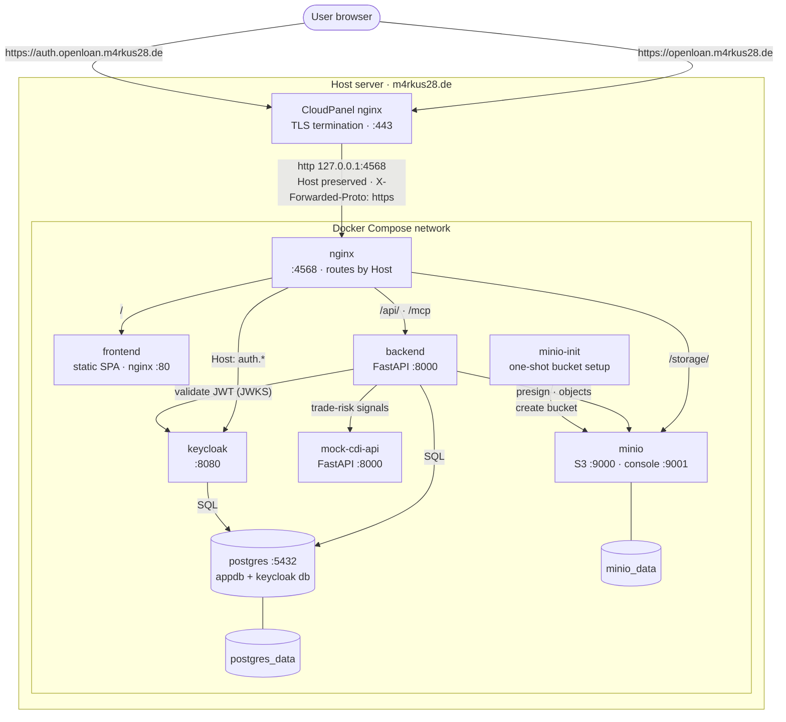
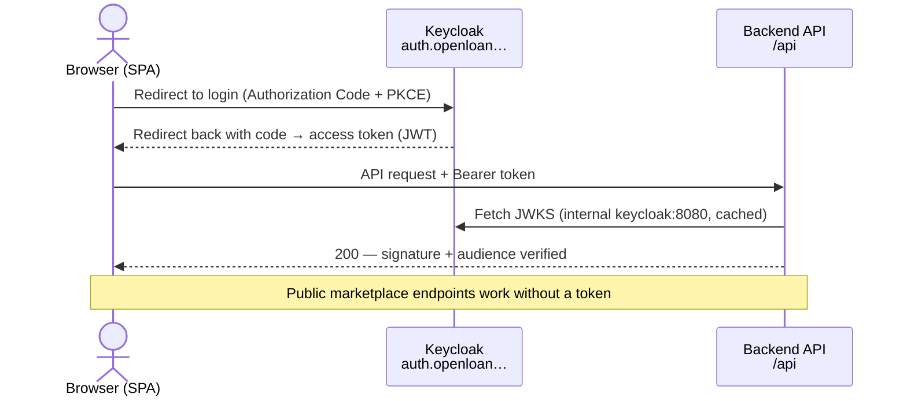
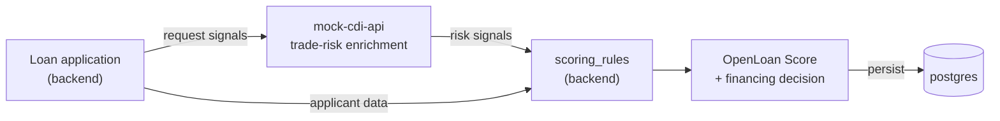

# OpenLoan — Architecture

OpenLoan is a supply-chain lending demo. The stack runs as a single Docker
Compose project behind **CloudPanel**, which terminates TLS and reverse-proxies
to the bundled Docker nginx.

- **Edge:** CloudPanel nginx terminates HTTPS for `openloan.m4rkus28.de` and
  `auth.openloan.m4rkus28.de`, then proxies (plain HTTP, original `Host`
  preserved) to the Docker nginx on `127.0.0.1:4568`.
- **Docker nginx (`:4568`):** single entry point into the compose network;
  routes by `Host` (app vs. auth subdomain) and by path.
- **Auth:** Keycloak (OIDC, Authorization Code + PKCE). The SPA talks to Keycloak
  directly via the `auth.` subdomain; the backend only validates JWTs against
  Keycloak's JWKS.
- **Scoring:** the backend enriches loan applications with trade-risk signals
  from `mock-cdi-api` (a stand-in for a CDI-style trade-data service) and
  computes the credit score itself.

## Deployment topology

## Request routing (Docker nginx `:4568`)

| Host | Path | Upstream | Purpose |
| --- | --- | --- | --- |
| `openloan.m4rkus28.de` | `/` | `frontend:80` | SPA (with `index.html` fallback) |
| `openloan.m4rkus28.de` | `/api/` | `backend:8000` | REST API (`/api/v1/…`) |
| `openloan.m4rkus28.de` | `/mcp` | `backend:8000/mcp` | MCP endpoint (streamable HTTP) |
| `openloan.m4rkus28.de` | `/storage/` | `minio:9000` | presigned upload/download passthrough |
| `auth.openloan.m4rkus28.de` | `/` | `keycloak:8080` | Keycloak (login, token, JWKS) |

`X-Forwarded-Proto` from CloudPanel is forwarded through (see the
`$forwarded_proto` map in `nginx/nginx.conf`) so Keycloak builds correct
`https` issuer/redirect URLs even though the Docker nginx itself speaks HTTP.

## Authentication flow (OIDC, PKCE)

## Loan scoring (data flow)

The final credit score and financing decision are always computed inside the
backend — `mock-cdi-api` only supplies input signals.

## Dev vs. Prod

| Aspect | Dev (`docker compose up`) | Prod (`docker compose --env-file .env.production -f docker-compose.yml up -d`) |
| --- | --- | --- |
| Compose files | `docker-compose.yml` + `docker-compose.override.yml` | `docker-compose.yml` only |
| Frontend | Vite dev server (`:5173`, HMR) | static build served by nginx (`:80`) |
| Backend | uvicorn `--reload` | uvicorn `--workers 4` |
| nginx config | `nginx/conf.d/dev.conf` → `localhost:80` | `nginx/conf.d/default.conf` → `:4568`, real domains |
| TLS / entry | none (plain `http://localhost`) | CloudPanel terminates TLS → Docker nginx `127.0.0.1:4568` |
| Keycloak hostname | `localhost:8080` | `auth.openloan.m4rkus28.de` (`KC_PROXY=edge`) |
| Exposed ports | DB/MinIO/KC/backend published for debugging | only `127.0.0.1:4568` (nginx) |

DB migrations run automatically on backend start (`entrypoint.sh` →
`alembic upgrade head`).

See [`../cloudpannel/vhost`](../cloudpannel/vhost) for the CloudPanel vhost and
[`deploy.sh`](../deploy/deploy.sh) for the production deploy script.
